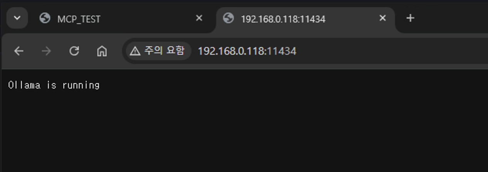

# Network Open the OLLAMA Model (in MAC OS)

1. LaunchAgent 플리스트 파일 생성

```
mkdir -p ~/Library/LaunchAgents
touch ~/Library/LaunchAgents/com.ollama.server.plist
open -e ~/Library/LaunchAgents/com.ollama.server.plist
```

2.  플리스트 내용 작성 및 저장

```xml
<?xml version="1.0" encoding="UTF-8"?>
<!DOCTYPE plist PUBLIC "-//Apple//DTD PLIST 1.0//EN"
 "http://www.apple.com/DTDs/PropertyList-1.0.dtd">
<plist version="1.0">
<dict>
 <key>Label</key>
 <string>com.ollama.server</string>
 <key>ProgramArguments</key>
 <array>
   <string>/usr/local/bin/ollama</string>
   <string>serve</string>
 </array>
 <key>EnvironmentVariables</key>
 <dict>
   <key>OLLAMA_HOST</key>
   <string>http://0.0.0.0:11434</string>
 </dict>
 <key>RunAtLoad</key>
 <true/>
</dict>
</plist>
```

3.  플리스트 유효성 검사 및 등록

```
plutil ~/Library/LaunchAgents/com.ollama.server.plist
```

> 오류가 없다면

```
launchctl load -w ~/Library/LaunchAgents/com.ollama.server.plist
```

4. 정상 실행 여부 확인 (Check Port)

```
lsof -n -iTCP:11434 -sTCP:LISTEN
```

5. 실행 하기
   
